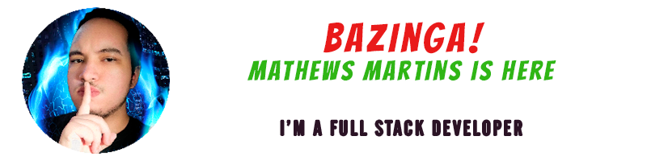

    <a href="https://pqpmath3ws.github.io">
        </img>
    </a>

My name is Mathews Martins (you can call me **PQPMath3ws** too, if you prefer), I have 23 years old, my zodiac sign is *sagittarius* and I am a brazilian person who loves the <code>technology and development/programming/coding</code>.

**Some things about me:**

- I'm the one of the few full stack brazilian developers who don't like coffee ☕⛔

- I love coding and study new technologies and programming languages 👨‍💻

- One of my hobbies is work with music (play, produce or study about) 🎶

- I have ASD Level 1, which helps me much in my job (different, right?) 🤓

- I'm big fan of a geek/nerd culture. 🤙

- And you can know more about me [here](https://github.com/PQPMath3ws/pqpmath3ws/issues) 👍

  

**Some status of my GitHub Profile:**

    </img>

    </img>

